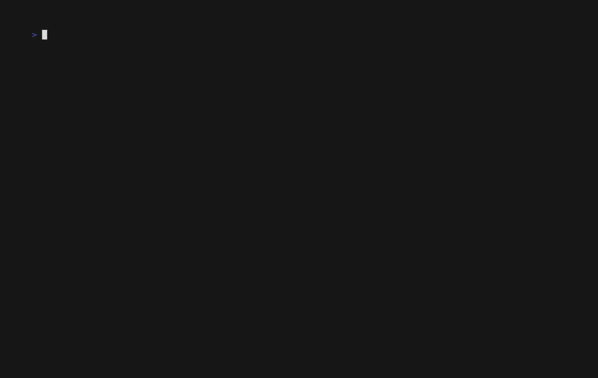

# Metusk

Metusk creates and verifies tamper-evident JSONL audit trails for AI agents,
with optional independent recording, ECDSA signatures, and LangGraph tool
callbacks.

It targets
[`draft-sharif-agent-audit-trail-01`](https://datatracker.ietf.org/doc/draft-sharif-agent-audit-trail/),
an Internet-Draft rather than an official IETF standard.

## Architecture

```text
Agent or LangGraph tool
        │ synchronous HTTP callbacks
        ▼
RecorderClient ──127.0.0.1──▶ independent Metusk recorder
                                      │
                                      ├── ECDSA P-256 key
                                      └── signed, hash-chained JSONL
                                                    │
Public key ───────────────────────────────▶ verifier
```

The recorder owns record IDs, timestamps, chain links, persistence, and
signatures. It binds only to `127.0.0.1` and uses one worker.

## Install

From PyPI after release:

```console
uv add metusk
uv add "metusk[langgraph]"  # optional LangGraph adapter
```

From a source checkout:

```console
uv sync --all-extras
```

Python 3.11 or newer is required.

## Unsigned demo

```console
uv run metusk demo --output trail.jsonl
uv run metusk verify trail.jsonl
```

Unsigned trails detect edits to the captured hash chain, but an attacker can
regenerate an entirely new unsigned chain.

## Signed recorder demo

Start the loopback recorder in one terminal:

```console
uv run metusk serve --data-dir .metusk --port 8765
```

In another terminal:

```console
uv run metusk signed-demo --url http://127.0.0.1:8765
uv run metusk verify .metusk/trails/<session-id>.jsonl \
  --public-key .metusk/public_key.pem
```

The private key is `.metusk/private_key.pem`. Treat it as sensitive and never
commit or share it. Sessions left open when the recorder restarts are not
resumed.

## LangGraph integration

Install the optional dependency and pass the callback explicitly:

```python
from metusk import TrustLevel
from metusk.client import RecorderClient
from metusk.integrations.langgraph import LangGraphAuditSession

client = RecorderClient()
with LangGraphAuditSession(
    client,
    "https://example.com/agents/calculator",
    "0.3.0",
    TrustLevel.L2,
) as audit:
    result = graph.invoke(
        {"value": 4},
        config={"callbacks": [audit.callback]},
    )
client.close()
```

The deterministic demo uses a local tool and requires no model API key:

```console
uv run metusk langgraph-demo --url http://127.0.0.1:8765
```

The synchronous, fail-closed adapter records tool calls, tool responses, tool
errors, and one graph-level error. It does not record prompts, model outputs,
graph state, node execution, LLM callbacks, or activity that bypasses delivered
callbacks. Tool inputs, outputs, and exception messages are hashed before they
are sent to the recorder.

## Terminal demo



[`demo/metusk.tape`](demo/metusk.tape) reproduces recorder startup, a LangGraph
run, signed verification, trail tampering, and failed verification. Render it
with [VHS](https://github.com/charmbracelet/vhs):

```console
vhs demo/metusk.tape
```

## What Metusk establishes

- Hash links reveal modification, deletion, insertion, or reordering within a
  captured trail.
- A valid signature shows that a record was produced with the recorder's
  private key.
- A separate recorder process reduces an agent process's ability to rewrite
  already captured history.

Metusk does not establish that every action was reported, that recorded action
details are truthful or semantically correct, that activity outside observed
callbacks did not occur, or that the private-key holder is trustworthy. Anyone
with the private key can create apparently valid records. Metusk provides no
regulatory certification or proof of complete agent behavior.

Raw secrets and personal data should not be placed in `action_detail`. See
[`SECURITY.md`](SECURITY.md) for private vulnerability reporting.

## License

[MIT](LICENSE)
